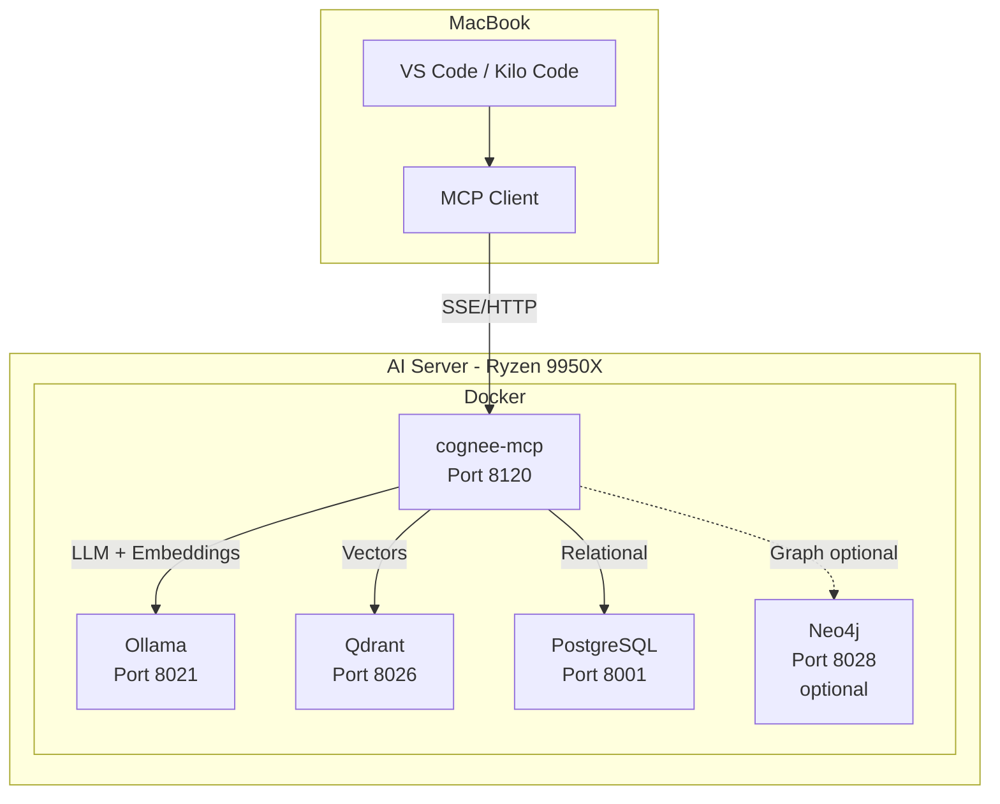

# Cognee & Cognee-MCP Integration Plan für AI LaunchKit

## Executive Summary

Dieses Dokument beschreibt den detaillierten Implementierungsplan zur Integration von **Cognee**, **cognee-mcp** und **cognee-frontend** in das AI LaunchKit. Cognee ist ein Python-Framework für AI Agent Memory Management, das Knowledge Graphs und Vector Databases kombiniert. Der cognee-mcp Server stellt diese Funktionen als MCP-Tools für IDE-Integration bereit. Das Frontend bietet eine Web-UI für Knowledge Graph Visualisierung.

### Komponenten-Übersicht

| Komponente | Port | Beschreibung | Status |
|------------|------|--------------|--------|
| **cognee-mcp** | 8120 | MCP Server (SSE/HTTP) | ✅ Empfohlen |
| **cognee-frontend** | 8122 | Web UI (Next.js) | ⚠️ Work in Progress |
| **cognee-nginx** | 8123 | Reverse Proxy (CORS-Fix) | 🔧 Für Remote-Zugriff |

---

## 1. Was ist Cognee?

### Kernfunktionen

| Feature | Beschreibung |
|---------|--------------|
| **ECL Pipeline** | Extract, Cognify, Load - automatische Datenverarbeitung |
| **Knowledge Graph** | Automatische Erstellung von Wissensgraphen aus Dokumenten |
| **Vector Search** | Semantische Suche durch Embeddings |
| **Multi-Format** | Text, PDFs, Bilder, Audio-Transkripte |
| **30+ Datenquellen** | Integrationen für diverse Datenquellen |
| **GraphRAG** | Kombiniert Graph + Vector für besseres Retrieval |

### Architektur

```
┌─────────────────────────────────────────────────────────────────────────────┐
│                              Cognee Stack                                    │
├─────────────────────────────────────────────────────────────────────────────┤
│                                                                              │
│  ┌──────────────────┐    ┌──────────────────┐    ┌──────────────────┐       │
│  │  cognee-frontend │    │   cognee-mcp     │    │  cognee-nginx    │       │
│  │   (Next.js UI)   │    │   (MCP Server)   │    │  (CORS Proxy)    │       │
│  │   Port: 8122     │    │   Port: 8120     │    │   Port: 8123     │       │
│  └────────┬─────────┘    └────────┬─────────┘    └────────┬─────────┘       │
│           │                       │                       │                  │
│           └───────────────────────┼───────────────────────┘                  │
│                                   │                                          │
│                           ┌───────▼───────┐                                  │
│                           │    Cognee     │                                  │
│                           │   (Library)   │                                  │
│                           └───────┬───────┘                                  │
│                                   │                                          │
└───────────────────────────────────┼──────────────────────────────────────────┘
                                    │
            ┌───────────────────────┼───────────────┬───────────────┐
            │                       │               │               │
            ▼                       ▼               ▼               ▼
     ┌──────────┐            ┌──────────┐    ┌──────────┐    ┌──────────┐
     │  Ollama  │            │  Qdrant  │    │ PostgreSQL│    │   Neo4j  │
     │  :8021   │            │  :8026   │    │   :8001   │    │  :8028   │
     └──────────┘            └──────────┘    └──────────┘    └──────────┘
        LLM +                  Vectors        Relational       Graph DB
      Embeddings                             (SQLite alt.)    (optional)
```

---

## 2. Deployment-Optionen

### Option A: Server-Installation (Empfohlen) ✅

**Cognee + cognee-mcp auf dem AI Server (Ryzen 9950X)**

| Aspekt | Details |
|--------|---------|
| **Vorteile** | Zentrale Memory-Instanz, GPU-Beschleunigung, keine lokale Installation nötig |
| **MCP-Zugriff** | Via HTTP/SSE Transport von MacBook aus |
| **IDE-Integration** | VS Code + Kilo Code verbinden sich remote |
| **Ressourcen** | Nutzt Server-GPU für Embeddings |

### Option B: MacBook-Installation

**Nicht empfohlen** - Cognee ist ressourcenintensiv und profitiert von GPU-Beschleunigung.

### Entscheidung: **Option A - Server-Installation**

---

## 3. Port-Zuweisung

Basierend auf der bestehenden AI LaunchKit Port-Struktur:

| Service | Port | Beschreibung |
|---------|------|--------------|
| cognee-mcp | **8120** | MCP Server (SSE/HTTP Transport) |
| cognee-api | **8121** | Cognee FastAPI Backend (optional, nicht implementiert) |
| cognee-frontend | **8122** | Web UI (Next.js) |
| cognee-nginx | **8123** | Reverse Proxy mit CORS-Fix |

**Begründung:**
- Port-Range 8100-8119 ist für Research & Notebooks reserviert
- 8120-8129 ist frei und passt zur Struktur
- Frontend auf 8122 (nicht 3000, da oft belegt)

---

## 4. Implementierungsplan

### Phase 1: Docker Compose Integration

#### 4.1 Neue Services in `docker-compose.local.yml`

```yaml
# ============================================================================
# COGNEE - AI Memory & Knowledge Graph (8120-8121)
# ============================================================================

cognee-mcp:
  image: cognee/cognee-mcp:main
  container_name: cognee-mcp
  profiles: ["cognee"]
  restart: unless-stopped
  ports:
    - "8120:8000"
  environment:
    # Transport Mode
    - TRANSPORT_MODE=sse
    
    # LLM Configuration (Ollama with Qwen3)
    - LLM_API_KEY=ollama
    - LLM_MODEL=qwen3:8b
    - LLM_PROVIDER=ollama
    - LLM_ENDPOINT=http://ollama:11434/v1
    
    # Embedding Configuration (Ollama with Qwen3-Embedding)
    - EMBEDDING_PROVIDER=ollama
    - EMBEDDING_MODEL=qwen3-embedding:8b
    - EMBEDDING_ENDPOINT=http://ollama:11434/api/embed
    - EMBEDDING_DIMENSIONS=4096
    
    # Database Configuration (PostgreSQL)
    - DB_PROVIDER=postgres
    - DB_NAME=cognee
    - DB_HOST=postgres
    - DB_PORT=5432
    - DB_USERNAME=postgres
    - DB_PASSWORD=${POSTGRES_PASSWORD}
    
    # Vector Database (Qdrant)
    - VECTOR_DB_PROVIDER=qdrant
    - VECTOR_DB_URL=http://qdrant:6333
    - VECTOR_DB_KEY=${QDRANT_API_KEY}
    
    # Graph Database (optional - Neo4j)
    - GRAPH_DATABASE_PROVIDER=${COGNEE_GRAPH_PROVIDER:-kuzu}
    - GRAPH_DATABASE_URL=${COGNEE_GRAPH_URL:-}
    - GRAPH_DATABASE_USERNAME=${NEO4J_AUTH_USERNAME:-}
    - GRAPH_DATABASE_PASSWORD=${NEO4J_AUTH_PASSWORD:-}
    
    # Security
    - ACCEPT_LOCAL_FILE_PATH=True
    - ALLOW_HTTP_REQUESTS=True
    - REQUIRE_AUTHENTICATION=False
    
    # Telemetry
    - TELEMETRY_DISABLED=1
    
  volumes:
    - cognee_data:/app/.cognee_data
    - cognee_system:/app/.cognee_system
    - ./shared:/data/shared
  depends_on:
    cognee-init:
      condition: service_completed_successfully
    postgres:
      condition: service_healthy
  extra_hosts:
    - "host.docker.internal:host-gateway"
  healthcheck:
    test: ["CMD", "curl", "-f", "http://localhost:8000/health"]
    interval: 30s
    timeout: 10s
    retries: 5
    start_period: 90s

cognee-init:
  image: postgres:${POSTGRES_VERSION:-17-alpine}
  container_name: cognee-init
  profiles: ["cognee"]
  depends_on:
    postgres:
      condition: service_healthy
  environment:
    PGPASSWORD: ${POSTGRES_PASSWORD}
  command: >
    sh -c "
    psql -h postgres -U postgres -c \"CREATE DATABASE cognee\" || true &&
    echo 'Cognee database ready'
    "
  restart: "no"

# Cognee Frontend (Web UI for Knowledge Graph Visualization)
cognee-frontend:
  build:
    context: https://github.com/topoteretes/cognee.git#main:cognee-frontend
    dockerfile: Dockerfile
  container_name: cognee-frontend
  profiles: ["cognee-ui"]
  restart: unless-stopped
  ports:
    - "8122:3000"
  environment:
    # API URL muss durch Nginx gehen wegen CORS
    - NEXT_PUBLIC_BACKEND_API_URL=http://cognee-nginx:80/api
  depends_on:
    - cognee-mcp
  healthcheck:
    test: ["CMD", "curl", "-f", "http://localhost:3000"]
    interval: 30s
    timeout: 10s
    retries: 3
    start_period: 60s

# Nginx Reverse Proxy für CORS-Fix (Frontend -> MCP API)
cognee-nginx:
  image: nginx:alpine
  container_name: cognee-nginx
  profiles: ["cognee-ui"]
  restart: unless-stopped
  ports:
    - "8123:80"
  volumes:
    - ./cognee/nginx.conf:/etc/nginx/nginx.conf:ro
  depends_on:
    - cognee-mcp
  healthcheck:
    test: ["CMD", "curl", "-f", "http://localhost:80/health"]
    interval: 30s
    timeout: 5s
    retries: 3
```

#### 4.2 Neue Volumes

```yaml
volumes:
  # ... existing volumes ...
  cognee_data:
  cognee_system:
```

### Phase 1b: Nginx CORS Proxy Konfiguration

#### 4.2b Neue Datei: `cognee/nginx.conf`

```nginx
# Cognee Nginx Reverse Proxy - CORS Fix für Remote Frontend Access
# Löst das Problem: cognee-mcp hat CORS hardcoded auf localhost:3000

events {
    worker_connections 1024;
}

http {
    upstream cognee_backend {
        server cognee-mcp:8000;
    }

    server {
        listen 80;
        server_name _;

        # Health Check Endpoint
        location /health {
            return 200 'OK';
            add_header Content-Type text/plain;
        }

        # API Proxy mit CORS Headers
        location /api {
            proxy_pass http://cognee_backend;
            proxy_http_version 1.1;
            proxy_set_header Host $host;
            proxy_set_header X-Real-IP $remote_addr;
            proxy_set_header X-Forwarded-For $proxy_add_x_forwarded_for;
            proxy_set_header X-Forwarded-Proto $scheme;

            # CORS Headers für alle Origins
            add_header 'Access-Control-Allow-Origin' '*' always;
            add_header 'Access-Control-Allow-Methods' 'GET, POST, PUT, DELETE, OPTIONS' always;
            add_header 'Access-Control-Allow-Headers' 'DNT,User-Agent,X-Requested-With,If-Modified-Since,Cache-Control,Content-Type,Range,Authorization' always;
            add_header 'Access-Control-Expose-Headers' 'Content-Length,Content-Range' always;

            # Handle preflight requests
            if ($request_method = 'OPTIONS') {
                add_header 'Access-Control-Allow-Origin' '*';
                add_header 'Access-Control-Allow-Methods' 'GET, POST, PUT, DELETE, OPTIONS';
                add_header 'Access-Control-Allow-Headers' 'DNT,User-Agent,X-Requested-With,If-Modified-Since,Cache-Control,Content-Type,Range,Authorization';
                add_header 'Access-Control-Max-Age' 1728000;
                add_header 'Content-Type' 'text/plain; charset=utf-8';
                add_header 'Content-Length' 0;
                return 204;
            }
        }

        # SSE Proxy (für MCP Clients)
        location /sse {
            proxy_pass http://cognee_backend;
            proxy_http_version 1.1;
            proxy_set_header Host $host;
            proxy_set_header Connection '';
            proxy_buffering off;
            proxy_cache off;
            chunked_transfer_encoding off;
            
            # SSE-spezifische Timeouts
            proxy_read_timeout 86400s;
            proxy_send_timeout 86400s;
        }

        # MCP HTTP Endpoint
        location /mcp {
            proxy_pass http://cognee_backend;
            proxy_http_version 1.1;
            proxy_set_header Host $host;
            proxy_set_header X-Real-IP $remote_addr;
        }
    }
}
```

### Phase 2: Environment Variables

#### 4.3 Neue Einträge in `.env.local.example`

```bash
############
# Cognee - AI Memory & Knowledge Graph
# Ports: 8120 (MCP Server)
# Documentation: docs/COGNEE_SETUP.md
############

# Cognee Port Configuration
COGNEE_MCP_PORT=8120

# Graph Database Provider (kuzu = local file-based, neo4j = external)
# kuzu is default and requires no additional setup
# neo4j requires the neo4j profile to be enabled
COGNEE_GRAPH_PROVIDER=kuzu

# Neo4j Configuration (only if COGNEE_GRAPH_PROVIDER=neo4j)
# Uses existing NEO4J_AUTH_USERNAME and NEO4J_AUTH_PASSWORD from above
COGNEE_GRAPH_URL=bolt://neo4j:7687

# Optional: Custom LLM settings (defaults use Ollama)
# COGNEE_LLM_MODEL=qwen2.5:7b-instruct-q4_K_M
# COGNEE_EMBEDDING_MODEL=nomic-embed-text:latest
```

### Phase 3: Setup Script

#### 4.4 Neues Script: `scripts/04e_setup_cognee.sh`

```bash
#!/bin/bash

# Cognee Setup Script for AI LaunchKit
# Prepares Cognee MCP Server with Ollama integration

set -e
source "$(dirname "$0")/utils.sh"

log_info "========== Cognee Setup =========="

# Check if cognee profile is enabled
if ! grep -q "cognee" .env 2>/dev/null; then
    log_info "Cognee profile not selected, skipping setup"
    exit 0
fi

log_info "Cognee profile detected, preparing setup..."

# Ensure required Ollama models are available
log_info "Checking Ollama models for Cognee..."

# Wait for Ollama to be ready
MAX_RETRIES=30
RETRY_COUNT=0
while ! curl -s http://localhost:8021/api/tags > /dev/null 2>&1; do
    RETRY_COUNT=$((RETRY_COUNT + 1))
    if [ $RETRY_COUNT -ge $MAX_RETRIES ]; then
        log_warning "Ollama not ready, models will be pulled on first Cognee start"
        break
    fi
    log_info "Waiting for Ollama... ($RETRY_COUNT/$MAX_RETRIES)"
    sleep 5
done

# Pull required models if Ollama is ready
if curl -s http://localhost:8021/api/tags > /dev/null 2>&1; then
    log_info "Pulling embedding model for Cognee..."
    docker exec ollama ollama pull qwen3-embedding:8b || {
        log_warning "Failed to pull qwen3-embedding:8b, will retry on first use"
    }
    
    # LLM model
    log_info "Verifying LLM model..."
    docker exec ollama ollama pull qwen3:8b || {
        log_warning "Failed to pull qwen3:8b, will retry on first use"
    }
fi

# Enable Qdrant if not already enabled (required for Cognee)
if ! grep -q "qdrant" .env 2>/dev/null; then
    log_info "Enabling Qdrant (required for Cognee vector storage)..."
    sed -i.bak 's/COMPOSE_PROFILES="\(.*\)"/COMPOSE_PROFILES="\1,qdrant"/' .env
fi

log_success "✅ Cognee setup complete!"
log_info "Cognee MCP will be available at: http://SERVER_IP:8120/sse"
```

### Phase 4: Wizard Integration

#### 4.5 Update `scripts/04_wizard_local.sh`

Füge Cognee zur Service-Auswahl hinzu:

```bash
# In der AI Services Sektion:
echo "  [C] Cognee - AI Memory & Knowledge Graph (GraphRAG)"

# In der Verarbeitung:
if [[ "$selection" == *"C"* ]] || [[ "$selection" == *"c"* ]]; then
    PROFILES+=("cognee")
    # Cognee requires Qdrant
    if [[ ! " ${PROFILES[@]} " =~ " qdrant " ]]; then
        PROFILES+=("qdrant")
    fi
fi
```

### Phase 5: Update Script Integration

#### 4.6 Update `scripts/update_local.sh`

Füge Cognee Health Check hinzu:

```bash
# Check Cognee
if [[ "$COMPOSE_PROFILES" == *"cognee"* ]]; then
    if docker ps | grep -q "cognee-mcp"; then
        log_success "✅ Cognee MCP is running (Port 8120)"
    else
        FAILED_SERVICES+=("cognee-mcp")
    fi
fi
```

### Phase 6: Dokumentation

#### 4.7 Neue Datei: `docs/COGNEE_SETUP.md`

```markdown
# Cognee Setup Guide - AI LaunchKit

## Overview

Cognee ist ein **AI Memory & Knowledge Graph Framework**, das automatisch 
Knowledge Graphs und Vector Databases aus deinen Daten erstellt.

### Key Features

- 🧠 **GraphRAG** - Kombiniert Knowledge Graph + Vector Search
- 📊 **ECL Pipeline** - Extract, Cognify, Load
- 🔍 **Semantic Search** - Bedeutungsbasierte Suche
- 📄 **Multi-Format** - Text, PDFs, Bilder, Audio
- 🔌 **MCP Server** - IDE-Integration via Model Context Protocol

---

## Access URLs

| Port | Endpoint | URL | Description |
|------|----------|-----|-------------|
| 8120 | **MCP SSE** | `http://SERVER_IP:8120/sse` | MCP Server (SSE Transport) |
| 8120 | **MCP HTTP** | `http://SERVER_IP:8120/mcp` | MCP Server (HTTP Transport) |
| 8120 | **Health** | `http://SERVER_IP:8120/health` | Health Check |

---

## MCP Client Configuration

### Kilo Code (VS Code)

Add to your MCP settings (`mcp_settings.json`):

\`\`\`json
{
  "mcpServers": {
    "cognee": {
      "url": "http://SERVER_IP:8120/sse",
      "transport": "sse"
    }
  }
}
\`\`\`

### Claude Desktop

\`\`\`json
{
  "mcpServers": {
    "cognee": {
      "type": "sse",
      "url": "http://SERVER_IP:8120/sse"
    }
  }
}
\`\`\`

### Cursor

\`\`\`json
{
  "mcpServers": {
    "cognee-sse": {
      "url": "http://SERVER_IP:8120/sse"
    }
  }
}
\`\`\`

---

## Available MCP Tools

| Tool | Description |
|------|-------------|
| `cognify` | Turns data into structured knowledge graph |
| `search` | Query memory (GRAPH_COMPLETION, RAG_COMPLETION, etc.) |
| `codify` | Analyze code repository, build code graph |
| `delete` | Delete specific data from dataset |
| `list_data` | List all datasets and data items |
| `prune` | Reset cognee (removes all data) |
| `save_interaction` | Log user-agent interactions |

---

## Architecture

Cognee uses existing AI LaunchKit services:

### Ollama (LLM + Embeddings)
- **LLM Model**: qwen3:8b
- **Embedding Model**: qwen3-embedding:8b (4096 dimensions)

### Qdrant (Vector Store)
- **Collection**: Auto-created by Cognee
- **Distance**: Cosine

### PostgreSQL (Relational Data)
- **Database**: cognee (auto-created)

### Graph Database (Knowledge Graph)
- **Default**: Kuzu (file-based, no setup needed)
- **Optional**: Neo4j (requires neo4j profile)

---

## Usage Examples

### Via MCP in IDE

\`\`\`
# Add data to Cognee
mcp--cognee--cognify: "Add this document to memory"

# Search memory
mcp--cognee--search: "What do you know about X?"

# List stored data
mcp--cognee--list_data
\`\`\`

### Via CLI (inside container)

\`\`\`bash
docker exec -it cognee-mcp cognee-cli add "Your text here"
docker exec -it cognee-mcp cognee-cli cognify
docker exec -it cognee-mcp cognee-cli search "Your query"
\`\`\`

---

## Troubleshooting

### Cognee Not Starting

\`\`\`bash
docker logs cognee-mcp
\`\`\`

### Model Not Found

\`\`\`bash
docker exec ollama ollama pull qwen3-embedding:8b
docker exec ollama ollama pull qwen3:8b
\`\`\`

### MCP Connection Issues

Test endpoint:
\`\`\`bash
curl -N http://SERVER_IP:8120/sse
\`\`\`

---

## Service Dependencies

| Service | Profile | Required |
|---------|---------|----------|
| PostgreSQL | (always on) | ✅ Yes |
| Qdrant | `qdrant` | ✅ Yes |
| Ollama | `cpu`/`gpu-*` | ✅ Yes |
| Neo4j | `neo4j` | ❌ Optional |

---

## Quick Reference

| Action | Command |
|--------|---------|
| Start | `docker compose -p localai -f docker-compose.local.yml up -d cognee-mcp` |
| Stop | `docker compose -p localai -f docker-compose.local.yml stop cognee-mcp` |
| Logs | `docker logs cognee-mcp -f` |
| Restart | `docker compose -p localai -f docker-compose.local.yml restart cognee-mcp` |
| Health | `curl http://SERVER_IP:8120/health` |
```

---

## 5. Implementierungs-Checkliste

### Docker Compose - MCP Server
- [ ] cognee-mcp Service Definition hinzufügen
- [ ] cognee-init Service für DB-Erstellung hinzufügen
- [ ] Neue Volumes (cognee_data, cognee_system) definieren
- [ ] Profile "cognee" konfigurieren

### Docker Compose - Frontend & CORS
- [ ] cognee-frontend Service Definition hinzufügen
- [ ] cognee-nginx Service Definition hinzufügen
- [ ] Profile "cognee-ui" konfigurieren
- [ ] cognee/nginx.conf erstellen

### Environment Variables
- [ ] COGNEE_MCP_PORT in .env.local.example
- [ ] COGNEE_FRONTEND_PORT in .env.local.example
- [ ] COGNEE_GRAPH_PROVIDER Option
- [ ] COGNEE_GRAPH_URL für Neo4j
- [ ] Dokumentation der Variablen

### Scripts
- [ ] 04e_setup_cognee.sh erstellen
- [ ] install_local.sh um Cognee-Setup erweitern
- [ ] 04_wizard_local.sh um Cognee-Option erweitern (MCP + UI separat)
- [ ] update_local.sh um Cognee Health Check erweitern

### Dokumentation
- [ ] docs/COGNEE_SETUP.md erstellen
- [ ] README.md aktualisieren (Service-Liste)
- [ ] .env.local.example Kommentare

### Testing
- [ ] Docker Build testen (MCP)
- [ ] Docker Build testen (Frontend)
- [ ] MCP-Verbindung von MacBook testen
- [ ] Frontend-Zugriff von MacBook testen
- [ ] CORS-Proxy verifizieren
- [ ] Ollama-Integration verifizieren
- [ ] Qdrant-Speicherung prüfen

---

## 6. Architektur-Diagramm



---

## 7. Nächste Schritte

1. **Plan Review** - Diesen Plan mit dir besprechen
2. **Implementation** - In Code-Mode wechseln und implementieren
3. **Testing** - Integration auf dem Server testen
4. **Documentation** - Finale Dokumentation erstellen

---

## 8. Kritischer Audit

### ⚠️ Potenzielle Probleme & Lösungen

#### 1. **Ollama Embedding Endpoint** - KRITISCH

**Problem:** Cognee erwartet laut `.env.template`:
```bash
EMBEDDING_ENDPOINT="http://localhost:11434/api/embed"
```

Aber Ollama's Standard-Embedding-Endpoint ist `/api/embeddings` (mit 's')!

**Lösung:** Prüfen welcher Endpoint korrekt ist:
- Cognee nutzt intern LiteLLM, das `/api/embed` erwartet
- Ollama bietet `/api/embeddings` an
- **Empfehlung:** Testen mit beiden Endpoints, ggf. anpassen

#### 2. **HUGGINGFACE_TOKENIZER** - OPTIONAL (nicht kritisch)

**Was macht der Tokenizer?**
- Token-Counting für Chunking und Context Window Management
- Cognee nutzt LiteLLM, das automatisch Fallback-Tokenizer verwendet

**Empfehlung:**
- **Weglassen** - LiteLLM handled das automatisch für Ollama
- Nur hinzufügen wenn Token-Counting-Probleme auftreten:
```yaml
- HUGGINGFACE_TOKENIZER=Qwen/Qwen3-8B  # Optional
```

#### 3. **qwen3-embedding:8b Verfügbarkeit** - PRÜFEN

**Problem:** `qwen3-embedding:8b` ist ein relativ neues Modell. Muss geprüft werden ob es in Ollama verfügbar ist.

**Lösung:** Vor Deployment prüfen:
```bash
ollama show qwen3-embedding:8b
```

Falls nicht verfügbar, Alternativen:
- `nomic-embed-text:latest` (768 Dimensionen)
- `mxbai-embed-large` (1024 Dimensionen)
- `bge-large` (1024 Dimensionen)

#### 4. **Qdrant Collection Dimension** - OK ✅

**Status:** Cognee verwendet qwen3-embedding:8b mit 4096 Dimensionen.

**Hinweis:** Cognee erstellt eigene Collections in Qdrant, kein Konflikt mit anderen Services.

#### 5. **Database Migration** - WICHTIG

**Problem:** Cognee führt beim Start Alembic-Migrationen aus. Bei Fehlern kann der Container nicht starten.

**Lösung:** Im entrypoint.sh ist bereits Error-Handling:
```bash
if [[ "$MIGRATION_OUTPUT" == *"UserAlreadyExists"* ]]; then
    echo "Warning: Default user already exists, continuing startup..."
```

**Empfehlung:** Logs überwachen beim ersten Start.

#### 6. **CORS für MCP** - KEIN PROBLEM ✅

**Analyse des Quellcodes:**
```python
# server.py - CORS ist hardcoded auf localhost:3000
allow_origins=["http://localhost:3000"]
```

**Aber:** CORS ist nur für **Browser-Requests** relevant!

**MCP-Clients (Kilo Code, Claude Desktop, Cursor):**
- Machen **direkte HTTP/SSE-Verbindungen**
- Keine Browser-Sandbox → **keine CORS-Prüfung**
- Funktioniert von jeder IP aus ✅

**Browser-Zugriff:**
- Würde blockiert werden
- Aber: MCP-Clients sind keine Browser

**Fazit:** CORS ist für unseren Use Case **kein Problem**.

#### 7. **Memory/Resource Requirements** - WICHTIG

**Problem:** Cognee + Ollama + Qdrant + PostgreSQL + Neo4j = hoher RAM-Verbrauch

**Geschätzte Anforderungen:**
| Service | RAM |
|---------|-----|
| Ollama (qwen3:8b) | ~8 GB |
| Ollama (qwen3-embedding:8b) | ~5 GB |
| Qdrant | ~1-2 GB |
| PostgreSQL | ~0.5-1 GB |
| Cognee-MCP | ~1-2 GB |
| **Total** | **~16-18 GB** |

**Lösung:** Dein Ryzen 9950X Server sollte genug RAM haben. Prüfen.

#### 8. **Network Connectivity** - OK ✅

**Status:** Alle Services nutzen bereits das gleiche Docker-Netzwerk (`localai_network`).

Docker Compose fügt Services automatisch zum Default-Netzwerk hinzu, wenn kein explizites Netzwerk angegeben ist. Da alle AI LaunchKit Services im gleichen `docker-compose.local.yml` definiert sind, können sie sich über Container-Namen erreichen (z.B. `ollama:11434`, `qdrant:6333`).

**Keine Änderung nötig** - Cognee wird automatisch im gleichen Netzwerk laufen.

### ✅ Korrigierte Docker Compose Konfiguration

```yaml
cognee-mcp:
  image: cognee/cognee-mcp:main
  container_name: cognee-mcp
  profiles: ["cognee"]
  restart: unless-stopped
  ports:
    - "8120:8000"
  # Kein explizites Netzwerk nötig - nutzt automatisch localai_network
  environment:
    # Transport Mode
    - TRANSPORT_MODE=sse
    
    # LLM Configuration (Ollama with Qwen3)
    - LLM_API_KEY=ollama
    - LLM_MODEL=qwen3:8b
    - LLM_PROVIDER=ollama
    - LLM_ENDPOINT=http://ollama:11434/v1
    
    # Embedding Configuration (Ollama with Qwen3-Embedding)
    - EMBEDDING_PROVIDER=ollama
    - EMBEDDING_MODEL=qwen3-embedding:8b
    - EMBEDDING_ENDPOINT=http://ollama:11434/api/embed
    - EMBEDDING_DIMENSIONS=4096
    - HUGGINGFACE_TOKENIZER=Qwen/Qwen3-8B  # NEU: Für Token-Counting
    
    # Database Configuration (PostgreSQL)
    - DB_PROVIDER=postgres
    - DB_NAME=cognee
    - DB_HOST=postgres
    - DB_PORT=5432
    - DB_USERNAME=postgres
    - DB_PASSWORD=${POSTGRES_PASSWORD}
    
    # Vector Database (Qdrant)
    - VECTOR_DB_PROVIDER=qdrant
    - VECTOR_DB_URL=http://qdrant:6333
    - VECTOR_DB_KEY=${QDRANT_API_KEY}
    
    # Graph Database (Kuzu default, Neo4j optional)
    - GRAPH_DATABASE_PROVIDER=${COGNEE_GRAPH_PROVIDER:-kuzu}
    - GRAPH_DATABASE_URL=${COGNEE_GRAPH_URL:-}
    - GRAPH_DATABASE_USERNAME=${NEO4J_AUTH_USERNAME:-}
    - GRAPH_DATABASE_PASSWORD=${NEO4J_AUTH_PASSWORD:-}
    
    # Security
    - ACCEPT_LOCAL_FILE_PATH=True
    - ALLOW_HTTP_REQUESTS=True
    - REQUIRE_AUTHENTICATION=False
    
    # Telemetry
    - TELEMETRY_DISABLED=1
    
  volumes:
    - cognee_data:/app/.cognee_data
    - cognee_system:/app/.cognee_system
    - ./shared:/data/shared
  depends_on:
    cognee-init:
      condition: service_completed_successfully
    postgres:
      condition: service_healthy
    qdrant:  # NEU: Explizite Abhängigkeit
      condition: service_started
      required: false
  extra_hosts:
    - "host.docker.internal:host-gateway"
  healthcheck:
    test: ["CMD", "curl", "-f", "http://localhost:8000/health"]
    interval: 30s
    timeout: 10s
    retries: 5
    start_period: 90s
```

### 📋 Pre-Deployment Checkliste

- [ ] Prüfen ob `qwen3-embedding:8b` in Ollama verfügbar ist
- [ ] Server RAM prüfen (mindestens 32 GB empfohlen)
- [ ] Qdrant API Key in .env setzen
- [ ] PostgreSQL Passwort in .env setzen
- [ ] Nach Deployment: CORS-Verhalten vom MacBook testen
- [ ] Logs überwachen beim ersten Start

---

*Erstellt: 2026-01-22*
*Status: Audit Complete - Ready for Implementation*
